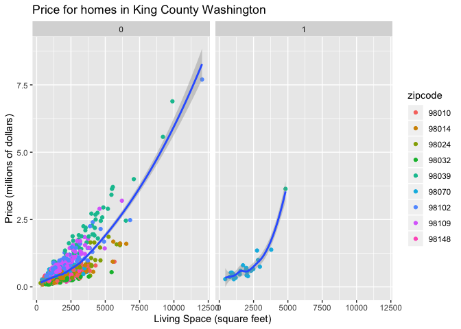
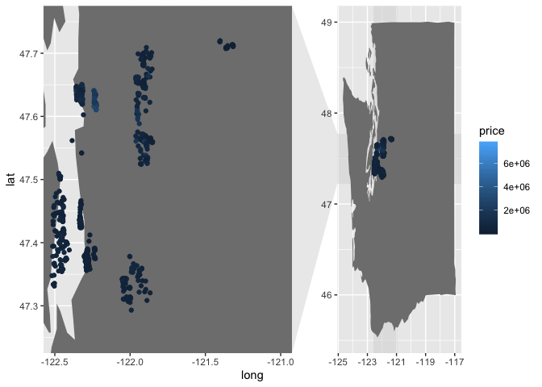

Lab 1
================
Group Member Names - here
January 15, 2020

Turn in one copy for each group, both as a word or PDF document and the
R Markdown source file.

## Lab Overview

For this lab, you will be exploring a dataset containing housing sales
in King County, Washington (the greater Seattle area). The intent of
this lab is to get a feel for some of the basic features using tidyverse
in R and explore this data set.

The entire lab will be worth 20 points. Please consider clarity of code
and thoughtful writing with an emphasis on concise interpretations as
each will be considered when grading labs.

## Questions

Answer the following questions in this R Markdown document. Please
include code where necessary.

Download the Seattle Housing dataset, available at:
<http://math.montana.edu/ahoegh/teaching/stat408/datasets/SeattleHousing.csv>.

``` r
library(tidyverse)
```

    ## ── Attaching packages ─────────────────────────────────── tidyverse 1.3.0 ──

    ## ✓ ggplot2 3.2.1     ✓ purrr   0.3.3
    ## ✓ tibble  2.1.3     ✓ dplyr   0.8.3
    ## ✓ tidyr   1.0.0     ✓ stringr 1.4.0
    ## ✓ readr   1.3.1     ✓ forcats 0.4.0

    ## ── Conflicts ────────────────────────────────────── tidyverse_conflicts() ──
    ## x dplyr::filter() masks stats::filter()
    ## x dplyr::lag()    masks stats::lag()

``` r
seattle_housing <- read_csv("http://math.montana.edu/ahoegh/teaching/stat408/datasets/SeattleHousing.csv")
```

    ## Parsed with column specification:
    ## cols(
    ##   price = col_double(),
    ##   bedrooms = col_double(),
    ##   bathrooms = col_double(),
    ##   sqft_living = col_double(),
    ##   sqft_lot = col_double(),
    ##   floors = col_double(),
    ##   waterfront = col_double(),
    ##   sqft_above = col_double(),
    ##   sqft_basement = col_double(),
    ##   zipcode = col_double(),
    ##   lat = col_double(),
    ##   long = col_double(),
    ##   yr_sold = col_double(),
    ##   mn_sold = col_double()
    ## )

``` r
seattle_housing <- seattle_housing %>% mutate(zipcode = factor(zipcode))
```

#### 1\. (4 points)

Describe the variables in the dataset. Select a few features in the data
set that you think are relevant for determining housing prices. How
might each of these influence housing prices?

The dataset contains information about 869 houses in King County,
Washington. There are several variables for each house: sales price,
number of bedrooms, number of bathrooms, and many others. It is possible
that most of the variables in the dataset would influence prices. In
particular, location-based information, such as zipcode, would be very
important. Furthermore, house specific information would also partially
determine the sales price of the house.

#### 2\. (4 points)

Use the `group_by()` function along with `summarize()` to create and
print a new dataframe that contains summary statistics on housing
prices. Write a short paragraph describing this
dataframe.

``` r
seattle_housing %>% group_by(zipcode) %>% summarize(average_price = round(mean(price)), median_living_sqft = median(sqft_living) )
```

    ## # A tibble: 9 x 3
    ##   zipcode average_price median_living_sqft
    ##   <fct>           <dbl>              <dbl>
    ## 1 98010          423666               1902
    ## 2 98014          455617               1905
    ## 3 98024          580638               1950
    ## 4 98032          251296               1720
    ## 5 98039         2161300               3560
    ## 6 98070          487480               1875
    ## 7 98102          901516               1800
    ## 8 98109          880078               1840
    ## 9 98148          284909               1570

This data frame contains information about the average housing price and
the median square footage of living space across 9 zipcodes. In
particular, Medina (zip = 98039) has larger homes that tend to be more
expensive. It also is the home to Jeff Bezos and Bill Gates.

#### 3\. (6 points)

Using `ggplot2` create two figures with at least one showing the
relationship between a variable in the data set with the housing
price.

``` r
seattle_housing %>% ggplot(aes(x = sqft_living, y = price/1000000)) + geom_point(aes(color = zipcode)) + geom_smooth(method = 'loess') + facet_wrap(.~waterfront) + ylab('Price (millions of dollars)') + xlab('Living Space (square feet)') + ggtitle('Price for homes in King County Washington')
```

<!-- -->

``` r
library(mapdata)
```

    ## Loading required package: maps

    ## 
    ## Attaching package: 'maps'

    ## The following object is masked from 'package:purrr':
    ## 
    ##     map

``` r
library(ggforce)

sw <- ggplot2::map_data('state') %>% filter(region == 'washington')

ggplot(sw, aes(x = long, y = lat, group = group)) +
  geom_polygon(fill = 'gray50') + geom_point(inherit.aes = F, aes(y=lat, x = long, color = price), data = seattle_housing) + facet_zoom(xlim = c(-122.5,-121), ylim = c(47.25,47.75))
```

<!-- -->

#### 4\. (4 points)

Summarize the take away points from your figures. These summaries should
be 3-4 sentences and provide all of the context for your graphics so
that an outside observer could understand the story you are
illustrating.

The first figure shows prices by zipcode for waterfront and
non-waterfront homes. Waterfront = 1 denotes the home is on the
waterfront. The fitted curve is included that illustrates the mean
relationship between price and square footage across all zipcodes for
waterfront and non-waterfront homes.

The second figure contains a map of the locations of the homes. Using
the facet\_zoom function in the `ggforce` library allows us to zoom in
on the map. It is interesting to note the King County is very large and
encompasses urban area and rural areas near Snoqualmie Pass.

#### 5\. (4 points)

Choose a variable or set of variables and create a subset of homes from
the entire the dataset. For example, consider homes with greater than 3
bedrooms. Then describe the differences between your selected subset of
homes and the entire data set. You can do this with numerical summaries,
graphical displays, and/or qualitative
descriptions.

``` r
seattle_housing %>% filter(waterfront == 1) %>% summarize(average_livingspace = mean(sqft_living), median_livingspace = median(sqft_living))
```

    ## # A tibble: 1 x 2
    ##   average_livingspace median_livingspace
    ##                 <dbl>              <dbl>
    ## 1               1877.               1940

``` r
seattle_housing %>% summarize(average_livingspace = mean(sqft_living), median_livingspace = median(sqft_living))
```

    ## # A tibble: 1 x 2
    ##   average_livingspace median_livingspace
    ##                 <dbl>              <dbl>
    ## 1               2114.               1850

The houses on the waterfront have a smaller average square footage
(~1900 square feet) relative to all of the houses in the dataset (~2100
square feet); however, the median living space (~1900 square feet) is
larger for waterfront houses.

#### 6\. (3 points)

Based on what you have found in this data set, how might you model
housing prices (\(Y_{price} = ?\))? Note, I am not asking you to fit a
model, but rather describe important relationships between the variables
and housing prices. You may discuss statistical modeling techniques, but
we will cover these later in the course.

There are several features that influence housing prices. Location, and
zipcode, seem to be very important. The size of the home also is
important to consider.
